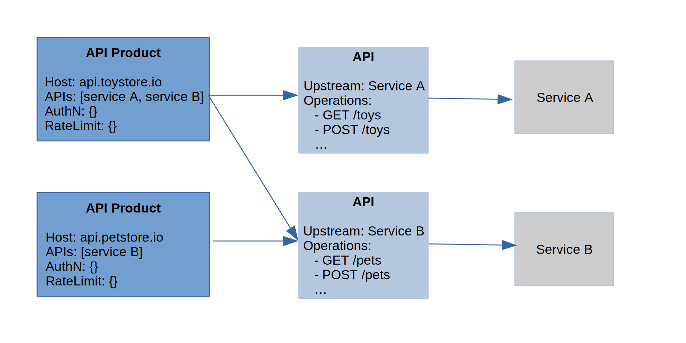

# Kuadrant Controller

[](https://github.com/Kuadrant/kuadrant-controller/actions/workflows/code-style.yaml)
[](https://github.com/Kuadrant/kuadrant-controller/actions/workflows/testing.yaml)
[](http://www.apache.org/licenses/LICENSE-2.0)

## Table of contents

TODO

## Overview

Kuadrant is a re-architecture of API Management using Cloud Native concepts and separating the components to be less coupled,
more reusable and leverage the underlying kubernetes platform. It aims to deliver a smooth experience to providers and consumers
of applications & services when it comes to rate limiting, authentication, authorization, discoverability, change management, usage contracts, insights, etc.

Kuadrant aims to produce a set of loosely coupled functionalities built directly on top of Kubernetes.
Furthermore it only strives to provide what Kubernetes doesn’t offer out of the box, i.e. Kuadrant won’t be designing a new Gateway/proxy,
instead it will opt to connect with what’s there and what’s being developed (think Envoy, GatewayAPI).

Kuadrant is a system of cloud-native k8s components that grows as users’ needs grow.
* From simple protection of a Service (via **AuthN**) that is used by teammates working on the same cluster, or “sibling” services, up to **AuthN** of users using OIDC plus custom policies.
* From no rate-limiting to rate-limiting for global service protection on to rate-limiting by users/plans

towards a full system that is more analogous to current API Management systems where business rules
and plans define protections and Business/User related Analytics are available.

Kuadrant relies on [Istio](https://istio.io/) to operate the
[istio ingress gateway](https://istio.io/latest/docs/reference/config/networking/gateway/)
to provide API management with authentication and rate limit capabilities. Kuadrant configures, optionally,
the integration of the [istio ingress gateway](https://istio.io/latest/docs/reference/config/networking/gateway/)
with few kuadrant components to provide the aforementioned capabilities.

* The AuthN/AuthZ enforcer [Authorino](https://github.com/Kuadrant/authorino)
* The rate limit service [Limitador](https://github.com/Kuadrant/limitador) which exposes a [GRPC] service implementing the [Envoy Rate Limit protocol (v3)](https://www.envoyproxy.io/docs/envoy/latest/api-v3/service/ratelimit/v3/rls.proto).


The kuadrant controller is the component reading the customer desired configuration
(declaratively as kubernetes custom resources) and ensures all components
are configured to obey customer's desired behavior.

## CustomResourceDefinitions

A core feature of the kuadrant controller is to monitor the Kubernetes API server for changes to
specific objects and ensure the owned k8s components configuration match these objects.
The kuadrant controller acts on the following [CRDs](https://kubernetes.io/docs/tasks/extend-kubernetes/custom-resources/custom-resource-definitions/):

* [APIProduct](apis/networking/v1beta1/apiproduct_types.go): Customer-facing APIs. APIProduct facilitates the creation of strong and simplified offerings for API consumers.
* [API](apis/networking/v1beta1/api_types.go): Internal APIs bundled in a product. Kuadrant API objects grant API providers the freedom to map their internal API organization structure to kuadrant.

An API Product can contain multiple APIs, and an API can be used in multiple API Products. In other words, to integrate and manage your API in kuadrant you need to create both:

* A kuadrant API CR containing at least the reference to the kuberntes service of your API.
* A kuadrant API Product CR for which you define the used APIs in addition to protection features like authN and rate limiting.

The following diagram illustrates the relationship between the CRDs with a simple example involving two API Products and two APIs.



### API Product CRD

An API Product custom resource looks like this:

```yaml
---
apiVersion: networking.kuadrant.io/v1beta1
kind: APIProduct
metadata:
  name: animaltoys
spec:
  hosts:
    - api.animaltoys.io
  APIs:
    - name: dogs
      namespace: default
    - name: cats
      namespace: default
  securityScheme:
    - name: MyAPIKey
      apiKeyAuth:
        location: authorization_header
        name: APIKEY
        credential_source:
          labelSelectors:
            secret.kuadrant.io/managed-by: authorino
            api: animaltoys
  rateLimit:
    global:
      maxValue: 100
      period: 30
    perRemoteIP:
      maxValue: 10
      period: 30
    authenticated:
      maxValue: 5
      period: 30
```

### API CRD

An API custom resource looks like this:

```yaml
---
apiVersion: networking.kuadrant.io/v1beta1
kind: API
metadata:
  name: toystore
  namespace: default
spec:
  destination:
    schema: http
    serviceReference:
      name: toystore
      namespace: default
      port: 80
  mappings:
    HTTPPathMatch:
      type: Prefix
      value: /
```

## List of features

| Feature | Description | Stage |
| --- | --- | --- |
| [OpenAPI 3.x](https://github.com/OAI/OpenAPI-Specification/blob/main/versions/3.0.2.md) | OpenAPI driven configuration. The document can be read from a configmap or served from the upstream API service | *Ready* |
| *Path Match* based routing | HTTP routing rules will be configured based on request path expressions. Accepted values are `Exact`, `Prefix` and `RegularExpression` | *Ready* |
| [Service Discovery](doc/service-discovery.md) | kubernetes [annotations](https://kubernetes.io/docs/concepts/overview/working-with-objects/annotations/) and [labels](https://kubernetes.io/docs/concepts/overview/working-with-objects/labels/) for a seamless integration | *Ready* |
| **AuthN** based on API key | Protect your service with a simple API key based authentication mechanism | *Ready* |
| **AuthN** based on [OpenID Connect (OIDC)](https://openid.net/connect/) | Kuadrant can verify OIDC (JWTs) tokens to authenticate users | *Ready* |
| Global Rate Limiting | Single global rate limit for all requests. Main use case for protecting infrastructure resources | *Ready* |
| Rate Limiting Per Remote IP | Rate limit configuration per each remote IP address. Main use case for protecting infrastructure resources | *Ready* |
| Authenticated Rate Limiting | Rate limit configuration per each authenticated client | *Ready* |
| Server TLS | TLS termination for downstream connections | Planned |
| Upstream TLS | Client certificates upstream connections | Planned |
| mTLS | Mutual TLS termination for downstream connections | Planned |
| [Gateway API](https://gateway-api.sigs.k8s.io/) | Implementation of kuadrant features on top of the Gateway API | Planned |
| Monitoring and Alerting | Observability based on [Grafana](https://grafana.com/) and [Prometheus](https://prometheus.io/) | Planned |

## [Getting started](doc/getting-started.md)

## [Service discovery](doc/service-discovery.md)

## User Guides

### [HTTP routing rules from OpenAPI stored in a configmap](doc/service-discovery-oas-configmap.md)

### [HTTP routing rules from OpenAPI served by the service](doc/service-discovery-oas-service.md)

### [HTTP routing rules with path matching](doc/service-discovery-path-match.md)

### [AuthN based on API key](doc/authn-api-key.md)

### [AuthN based on OpenID Connect](doc/authn-oidc.md)

### [Rate limit for your service](doc/rate-limit.md)

## Contributing

The [Development guide](doc/development.md) describes how to build the kuadrant controller and
how to test your changes before submitting a patch or opening a PR.

## Licensing

This software is licensed under the [Apache 2.0 license](https://www.apache.org/licenses/LICENSE-2.0).

See the LICENSE and NOTICE files that should have been provided along with this software for details.
