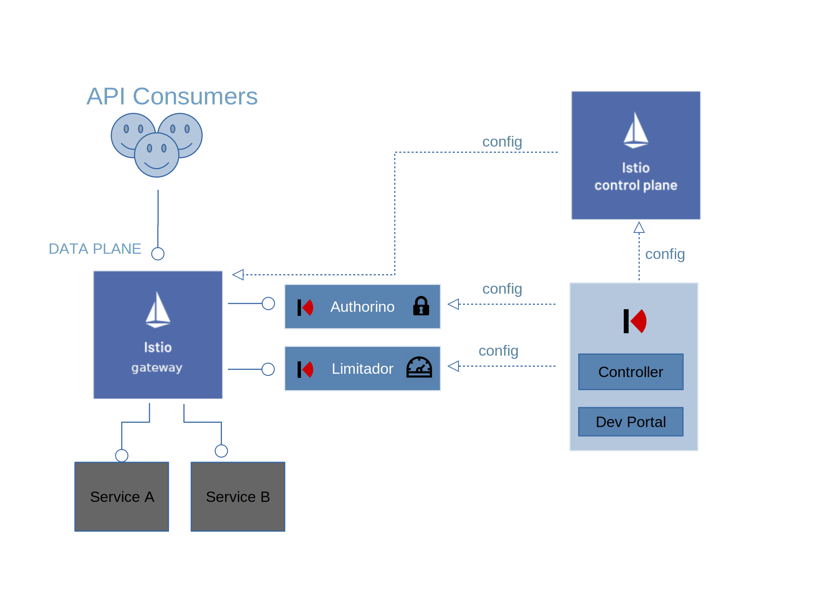

# Kuadrant Controller

[](https://github.com/Kuadrant/kuadrant-controller/actions/workflows/code-style.yaml)
[](https://github.com/Kuadrant/kuadrant-controller/actions/workflows/testing.yaml)
[](http://www.apache.org/licenses/LICENSE-2.0)

## Table of contents

TODO

## Overview

Kuadrant is a re-architecture of API Management using Cloud Native concepts and separating the components to be less coupled,
more reusable and leverage the underlying kubernetes platform. It aims to deliver a smooth experience to providers and consumers
of applications & services when it comes to rate limiting, authentication, authorization, discoverability, change management, usage contracts, insights, etc.

Kuadrant aims to produce a set of loosely coupled functionalities built directly on top of Kubernetes.
Furthermore it only strives to provide what Kubernetes doesn’t offer out of the box, i.e. Kuadrant won’t be designing a new Gateway/proxy,
instead it will opt to connect with what’s there and what’s being developed (think Envoy, GatewayAPI).

Kuadrant is a system of cloud-native k8s components that grows as users’ needs grow.
* From simple protection of a Service (via AuthN) that is used by teammates working on the same cluster, or “sibling” services, up to Auth of users using OIDC plus custom policies.
* From no rate-limiting to rate-limiting for global service protection on to rate-limiting by users/plans

towards a full system that is more analogous to current API Management systems where business rules
and plans define protections and Business/User related Analytics are available.

Kuadrant relies on [Istio](https://istio.io/) to operate the
[istio ingress gateway](https://istio.io/latest/docs/reference/config/networking/gateway/)
to provide API management with authentication and rate limit capabilities. Kuadrant configures, optionally,
the integration of the [istio ingress gateway](https://istio.io/latest/docs/reference/config/networking/gateway/)
with few kuadrant components to provide the aforementioned capabilities.

* The AuthN/AuthZ enforcer [Authorino](https://github.com/Kuadrant/authorino)
* The rate limit service [Limitador](https://github.com/Kuadrant/limitador) which exposes a [GRPC] service implementing the [Envoy Rate Limit protocol (v3)](https://www.envoyproxy.io/docs/envoy/latest/api-v3/service/ratelimit/v3/rls.proto).



The kuadrant controller is the component reading the customer desired configuration
(declaratively as kubernetes custom resources) and ensures all components
are configured to obey customer's desired behavior.

## CustomResourceDefinitions

A core feature of the kuadrant controller is to monitor the Kubernetes API server for changes to
specific objects and ensure the owned k8s components configuration match these objects.
The kuadrant controller acts on the following [CRDs](https://kubernetes.io/docs/tasks/extend-kubernetes/custom-resources/custom-resource-definitions/):

* [API](apis/networking/v1beta1/api_types.go): defines the kuadrant association to a kubernetes service object being the entry point of the API protected.
* [APIProduct](apis/networking/v1beta1/apiproduct_types.go): defines a desired API Product configuration for a set of kuadrant APIs.

## Getting Started

This guide lets you quickly evaluate Kuadrant.

### Requirements

* Having a [Kubernetes](https://kubernetes.io/) (1.19, 1.20, 1.21, 1.22) cluster up and running.
* Permission from the Kubernetes cluster to create Custom Resource Definitions (CRDs) during kuadrant's installation. Cluster administrators can handle this requirement through the Kubernetes API Role-Based Access Control bindings.
* A deployed [kubernetes service](https://kubernetes.io/docs/concepts/services-networking/service/) in the cluster acting as the entry point for your API.
* Golang 1.16 environment. Download and install steps [here](https://golang.org/doc/install)

**NOTE**: You can easily have a local cluster setup using [Kind](https://kind.sigs.k8s.io/). In this case, the requirement is to have [Docker](https://docker.com/).

### Download kuadrantctl tool

[`kuadrantctl`](https://github.com/Kuadrant/kuadrantctl) is the kuadrant configuration command line utility.
Currently `kuadrantctl install` command is the recommended installation method of kuadrant.

Download the latest release

```bash
go install github.com/kuadrant/kuadrantctl@latest
```

### Install kuadrant

The install command will create a namespace called `kuadrant-system` and deploy kuadrant services in that namespace.

```bash
kuadrantctl install
```

On successful command return, you should see the following deployments and pods created.

```bash
❯ k get pods -n kuadrant-system
NAME                                                     READY   STATUS    RESTARTS   AGE
authorino-controller-manager-XXXXXXXXXXX-XXXX            2/2     Running   0          3m6s
istiod-XXXXXXXXXX-XXXXX                                  1/1     Running   0          3m11s
kuadrant-controller-manager-XXXXXXXXXX-XXXX              2/2     Running   0          3m5s
kuadrant-gateway-XXXXXXXXXX-XXXX                         1/1     Running   0          3m5s
limitador-XXXXXXXXXX-XXXXX                               1/1     Running   0          2m13s
limitador-operator-controller-manager-XXXXXXXXXX-XXXXX   2/2     Running   0          3m6s


❯ k get deployments -n kuadrant-system
NAME                                    READY   UP-TO-DATE   AVAILABLE   AGE
authorino-controller-manager            1/1     1            1           4m51s
istiod                                  1/1     1            1           4m57s
kuadrant-controller-manager             1/1     1            1           4m50s
kuadrant-gateway                        1/1     1            1           4m51s
limitador                               1/1     1            1           3m58s
limitador-operator-controller-manager   1/1     1            1           4m51s
```

## [Kuadrant service discovery](doc/service-discovery.md)

## User Guides

### [Basic setup for your service](doc/basic-setup.md)

### [Setup HTTP routing rules from OpenAPI stored in a configmap](doc/service-discovery-oas-configmap.md)

### [Setup HTTP routing rules from OpenAPI served by the service](doc/service-discovery-oas-service.md)

### [Setup HTTP routing rules with matching rules](doc/service-discovery-matching-rules.md)

### Add AuthN for your service

### Add rate limit for your service

## Contributing

The [Development guide](doc/development.md) describes how to build the kuadrant controller and
how to test your changes before submitting a patch or opening a PR.

## Licensing

This software is licensed under the [Apache 2.0 license](https://www.apache.org/licenses/LICENSE-2.0).

See the LICENSE and NOTICE files that should have been provided along with this software for details.
